## 1. Tầm quan trọng của việc học bơi theo giáo trình khoa học chuẩn sư phạm

Đối với học viên mới bắt đầu học bơi từ con số 0, việc sở hữu một giáo trình học tập bài bản, lộ trình rõ ràng là yếu tố tiên quyết quyết định sự thành bại của khóa học. Nhiều người tự mày mò học bơi bằng cách tự ra bể bơi công cộng tập luyện tự do hoặc xem các [video học bơi] trên mạng internet. Tuy nhiên, nếu thiếu đi sự hướng dẫn chi tiết của giáo viên và một [giáo trình học bơi] chuẩn sư phạm, học viên rất dễ tập sai kỹ thuật (co chân quá sâu, quạt tay quá rộng làm chìm người) dẫn đến nhanh mệt mỏi, sặc nước và dễ nản chí bỏ cuộc.

Bơi ếch (breaststroke) là kiểu bơi nền tảng lý tưởng nhất cho người mới bắt đầu nhờ chuỗi động tác đối xứng rõ ràng và kỹ thuật lấy hơi ngửa cổ lên trực tiếp rất an toàn. Để giúp học viên dễ dàng theo dõi tiến độ luyện tập và đạt kết quả nhanh chóng nhất, trung tâm CanSwim đã xây dựng **giáo trình dạy bơi ếch chuẩn hóa 10 buổi** đã được áp dụng thành công cho hàng ngàn học viên tại [Bể bơi Newton Cầu Giấy](/be-boi-newton-hoang-quoc-viet/).

Hãy cùng khám phá chi tiết lộ trình 10 buổi học thực hành bài bản của chúng tôi ngay dưới đây.

---

## 2. Chi tiết giáo trình dạy bơi ếch 10 buổi chuẩn sư phạm của CanSwim

Giáo trình bơi ếch của CanSwim được thiết kế chia làm 4 giai đoạn logic đi từ cơ bản làm quen nước đến hoàn thiện bơi quãng dài và kỹ năng tự cứu:

```mermaid
gantt
    title Lộ trình 10 buổi học bơi ếch CanSwim
    dateFormat  X
    axisFormat %d
    section Giai đoạn 1: Làm quen nước
    Khởi động, tập thở, đứng nước, thả nổi :active, 1, 2
    section Giai đoạn 2: Kỹ thuật đơn lẻ
    Đạp chân ếch chuẩn xác : 3, 4
    Quạt tay phối hợp nhấc đầu lấy hơi : 5, 5
    section Giai đoạn 3: Phối hợp & Bơi ngắn
    Phối hợp tay - chân - thở : 6, 8
    section Giai đoạn 4: Hoàn thiện & Tốt nghiệp
    Bơi cự ly 15-25m liên tục, kỹ năng tự cứu : 9, 10
```

---

### Giai đoạn 1: Khởi động, tập thở nước và làm quen cảm giác nước (Buổi 1 - 2)
Giai đoạn này tập trung giải tỏa tâm lý nhát nước cho học viên mới:
* **Khởi động trên cạn**: Giáo viên hướng dẫn các bài tập kéo giãn cơ khớp vai, khớp hông và đầu gối để tránh chuột rút.
* **Học kỹ thuật thở nước đúng cách**: Hít hơi nhanh và sâu bằng miệng trên mặt nước - ngụp đầu xuống nước thở ra từ từ bằng mũi.
* **Thả nổi cơ thể**: Tập thả lỏng toàn thân để cảm nhận sức nâng của nước, giữ cơ thể nổi ngang mặt nước.
* **Đứng nước thăng bằng**: Kỹ năng chuyển từ tư thế nằm bơi sang tư thế đứng thẳng trong nước sâu một cách an toàn.

### Giai đoạn 2: Luyện tập kỹ thuật đạp chân và quạt tay ếch đơn lẻ (Buổi 3 - 5)
Hình thành và chuẩn hóa động tác kỹ thuật đơn lẻ:
* **Động tác đạp chân ếch**: Tập co chân nhẹ nhàng trên thành bể trước khi xuống nước thực hành kết hợp phao tim cầm tay. Nguyên tắc là bẻ bàn chân hướng ra ngoài và đạp khép mạnh hai chân ép nước tạo lực đẩy lướt đi.
* **Động tác quạt tay ếch**: Tập quạt tay đẩy nước sang hai bên kết hợp nhấc đầu lên cao để hít hơi nhanh bằng miệng.

### Giai đoạn 3: Phối hợp động tác tay - chân - nhịp thở và bơi quãng ngắn (Buổi 6 - 8)
Học viên bắt đầu kết hợp các động tác thành chuỗi vận động tuần hoàn:
* **Học quy tắc phối hợp**: "Tay quạt đầu lên lấy hơi - Chân đạp lướt nước".
* **Thực hành quãng ngắn**: Bơi cự ly từ 5m đến 10m liên tục để xây dựng sự tự tin.
* **Sửa lỗi kỹ thuật trực tiếp**: HLV theo sát chỉnh sửa lỗi co chân quá sâu làm cản nước hoặc quạt tay quá mạnh gây tốn sức.

### Giai đoạn 4: Hoàn thiện bơi cự ly dài và tốt nghiệp kỹ năng sinh tồn (Buổi 9 - 10)
Tối ưu hóa kỹ thuật bơi lội và rèn luyện thể lực:
* **Luyện tập quãng dài**: Tăng cự ly bơi lên 15m - 25m bể tiêu chuẩn liên tục.
* **Kiểm tra năng lực tốt nghiệp**: Học viên tự bơi độc lập đúng kỹ thuật mà không cần phao hỗ trợ.
* **Kỹ năng sinh tồn tự cứu**: Hướng dẫn cách xử lý chuột rút khi đang bơi và kỹ thuật thả nổi ngửa tự cứu sinh tồn khi gặp sự cố đột ngột.

---

## 3. Tại sao giáo trình CanSwim giúp học viên bơi nhanh và đúng kỹ thuật nhất?

CanSwim tự hào có giáo trình [hướng dẫn học bơi] đem lại hiệu quả cao vượt trội nhờ các điểm khác biệt:

### Huấn luyện viên trực tiếp xuống nước kèm cặp
Giáo viên của chúng tôi không đứng trên bờ chỉ đạo bằng loa hay sào bơi. HLV trực tiếp xuống nước để nâng đỡ cơ thể học viên nhát nước, cầm tay uốn nắn từng góc bẻ bàn chân đạp nước và chỉnh sửa nhịp thở ngay tại chỗ, giúp học viên cảm thấy an toàn tuyệt đối.

### Cá nhân hóa giáo án theo thể chất từng học viên
Mỗi người có một thể trạng và mức độ sợ nước khác nhau. CanSwim linh hoạt điều chỉnh tiến độ của giáo trình phù hợp với tốc độ tiếp thu của từng cá nhân, đảm bảo học viên không bị ngợp hay áp lực trong suốt khóa học.

### Sĩ số lớp học nhóm siêu nhỏ an toàn tối đa
Lớp học bơi kèm riêng sĩ số chỉ từ 1 đến 3 học viên/ca giúp giáo viên có thể bao quát toàn bộ hoạt động dưới nước, sửa lỗi sai chi tiết từng giây cho từng học viên. Đối với học sinh lớn và người lớn muốn tiết kiệm chi phí, trung tâm cũng cung cấp [Lớp bơi tập thể CanSwim](/lop-boi-tap-the-be-boi-newton) với sĩ số giới hạn tối đa 10 học viên/ca để bảo đảm chất lượng giảng dạy.

---

## 4. Địa điểm học bơi bốn mùa nước ấm lý tưởng tại Bể bơi Newton Cầu Giấy

Để thực hành giáo trình bơi ếch một cách thoải mái nhất, lớp học bơi CanSwim được tổ chức tại [Bể bơi Newton Cầu Giấy](/be-boi-newton-hoang-quoc-viet/), cuối ngõ 234 Hoàng Quốc Việt (KĐT Nam Cường, phường Nghĩa Đô):

* **Bể nước ấm ổn định 29 - 31 độ C**: Bể bơi trong nhà có mái che khép kín, hoàn toàn kín gió giúp học viên thoải mái bơi lội quanh năm mà không lo bị cảm lạnh.
* **Công nghệ điện phân muối Châu Âu**: Nước bể cực kỳ sạch sẽ, trong suốt tự nhiên, không sử dụng hóa chất clo tẩy rửa công nghiệp nên tuyệt đối không cay mắt, đỏ mắt hay khô xơ da của trẻ nhỏ.
* **Làn bơi tiêu chuẩn dài 25m**: Rộng rãi và thoáng mát, vô cùng lý tưởng cho việc rèn luyện thể lực bơi quãng dài.

Học viên và phụ huynh muốn nhận tư vấn chi tiết có thể truy cập trang [Lớp dạy bơi bể bơi Newton 234 Hoàng Quốc Việt](/lop-day-boi-be-boi-newton-234-hoang-quoc-viet/).

---

## 5. Những lưu ý giúp học viên nhanh biết bơi nhất

Bên cạnh việc bám sát giáo trình của CanSwim, học viên cần lưu ý:
1. **Đi học đều đặn, không nghỉ ngắt quãng**: Việc đi học đều 2 - 3 buổi/tuần sẽ giúp cơ thể ghi nhớ cảm giác nước tốt nhất.
2. **Luôn lắng nghe giáo viên chỉnh lỗi**: Tránh bơi tự do quá sớm khi chưa hoàn thiện động tác đạp chân quạt tay vì dễ hình thành thói quen sai kỹ thuật.
3. **Thả lỏng toàn thân**: Sự căng thẳng cơ bắp sẽ làm cơ thể dễ chìm. Thả lỏng tinh thần và thể chất là chìa khóa vàng giúp bạn nổi nước tự nhiên.

Liên hệ đăng ký khóa học bơi CanSwim tại bể bơi Newton ngay hôm nay để trải nghiệm giáo trình dạy bơi chuẩn sư phạm và nhanh chóng làm chủ kỹ năng bơi lội sinh tồn quan trọng!

---

### Thông tin tác giả bài viết

* **Tác giả bài viết**: HLV Bùi Văn Cán
* **Chức vụ**: Huấn luyện viên trưởng và người sáng lập trung tâm dạy bơi CanSwim tại bể bơi Newton.
* **Kinh nghiệm**: Hơn 10 năm kinh nghiệm huấn luyện sư phạm bơi lội, đào tạo hàng ngàn học viên biết bơi đúng kỹ thuật.
* **Hình ảnh đại diện tác giả**:

* **Kết nối chuyên môn**: Học viên có thể tìm hiểu thêm các hoạt động giảng dạy thực tế và tương tác trực tiếp với tôi qua [Fanpage Facebook CanSwim Bể bơi Newton](https://www.facebook.com/beboinewton).

---

*(Bài viết liên quan khuyên đọc: Xem thêm hướng dẫn chỉ đường đi nhanh nhất tại bài viết [Bản đồ chỉ đường bể bơi Newton 234 Hoàng Quốc Việt](/cam-nang/ban-do-chi-duong-be-boi-newton-234-hoang-quoc-viet/) từ các huấn luyện viên).*
